<!-- Please do not change this logo with link -->

# Signal Scaling with the OPAMP on the PIC18-Q41 Family of MCUs

This demo application shows how to use the Operational Amplifier (OPAMP) in the PIC18-Q41 family of MCUs to create a Programmable Gain Amplifier to be used with the on-board Analog-to-Digital Converter with Computation (ADCC). The ADCC is triggered automatically by Timer 0 (TMR0) while the device is in sleep mode to reduce power consumption and to improve ADC measurement of high-Z or small signals. Pushbutton debouncing is performed by using the Configurable Logic Cells (CLCs) and Timer 2 (TMR2).

## Related Documentation

- [PIC18F16Q41 Documentation](https://www.microchip.com/en-us/product/PIC18F16Q41?utm_source=GitHub&utm_medium=TextLink&utm_campaign=MCU8_MMTCha_pic18q41&utm_content=pic18f1q41-analog-demo-mplab-mcc-github)

## Software Used

- [MPLAB® X IDE v5.50 or newer](https://www.microchip.com/en-us/development-tools-tools-and-software/mplab-x-ide?utm_source=GitHub&utm_medium=TextLink&utm_campaign=MCU8_MMTCha_pic18q41&utm_content=pic18f1q41-analog-demo-mplab-mcc-github)
- [MPLAB XC8 v2.32 or newer](https://www.microchip.com/en-us/development-tools-tools-and-software/mplab-xc-compilers?utm_source=GitHub&utm_medium=TextLink&utm_campaign=MCU8_MMTCha_pic18q41&utm_content=pic18f1q41-analog-demo-mplab-mcc-github)
- [MPLAB Code Configurator (MCC) v4.2.3](https://www.microchip.com/en-us/development-tools-tools-and-software/embedded-software-center/mplab-code-configurator?utm_source=GitHub&utm_medium=TextLink&utm_campaign=MCU8_MMTCha_pic18q41&utm_content=pic18f1q41-analog-demo-mplab-mcc-github)
  - [Melody Library v1.84.5](https://www.microchip.com/en-us/development-tools-tools-and-software/embedded-software-center/mplab-code-configurator?utm_source=GitHub&utm_medium=TextLink&utm_campaign=MCU8_MMTCha_pic18q41&utm_content=pic18f1q41-analog-demo-mplab-mcc-github)
- [PIC18F-Q_DFP v1.12.193 or newer](https://packs.download.microchip.com/)
- [MPLAB Data Visualizer Plugin](https://www.microchip.com/en-us/development-tools-tools-and-software/embedded-software-center/mplab-data-visualizer?utm_source=GitHub&utm_medium=TextLink&utm_campaign=MCU8_MMTCha_pic18q41&utm_content=pic18f1q41-analog-demo-mplab-mcc-github) or serial terminal

## Hardware Used

- [PIC18F16Q41 Curiosity Nano Evaluation Kit (EV26Q64A)](https://www.microchip.com/en-us/development-tool/EV26Q64A?utm_source=GitHub&utm_medium=TextLink&utm_campaign=MCU8_MMTCha_pic18q41&utm_content=pic18f1q41-analog-demo-mplab-mcc-github)
  - Running at 3.3V (default)
- Variable Power Supply or Other Signal Source
- Breadboard and Wire (for connecting)

## I/O Setup

| I/O Pin | Name
| ------  | ----
| RA2 | OPAMP Input (+)
| RB5 | UART RX (unused)
| RB7 | UART TX
| RC0 | Switch 0 (SW0)
| RC1 | LED0
| RC2 | OPAMP Output

## Peripheral Configuration

The settings below are the key settings used to implement the functionality in this example.

**System Clock** - 4 MHz HFINTOSC, 4x Clock Divider  
**UART** - 9600 Baud (High Speed Baud Rate Generator ON), 8-bits, No Parity, 1 Stop Bit, Redirect STDIO to UART  
**ADCC** - Single Sample, Clock source is ADCRC, Auto-Conversion Trigger TMR0, AQ time of 6 cycles, Interrupt on Sample  
**OPA1** (OPAMP) - Charge Pump On, Unity Gain Buffer, Positive Channel OPA1IN+, Positive Source Selection OPA1IN2+  
**TMR0** - Runs from LFINTOSC at a period of 1s  
**TMR2** -  Start on Rising Edge of CLC2_OUT, Period is 8.25ms, Interrupt Enabled     
**CLC1** - D-Input Flip-Flop, Clocked by LFINTOSC, Latched Value = SW0   
**CLC2** - D-Input Flip-Flop, Clocked by LFINTOSC, Latched Value = (CLC1_OUT & SW0)  

### UART1 Settings

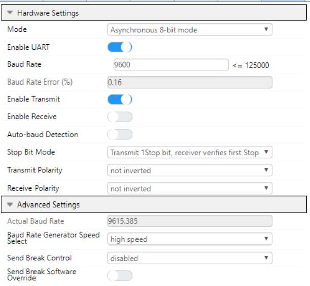

### ADCC Settings

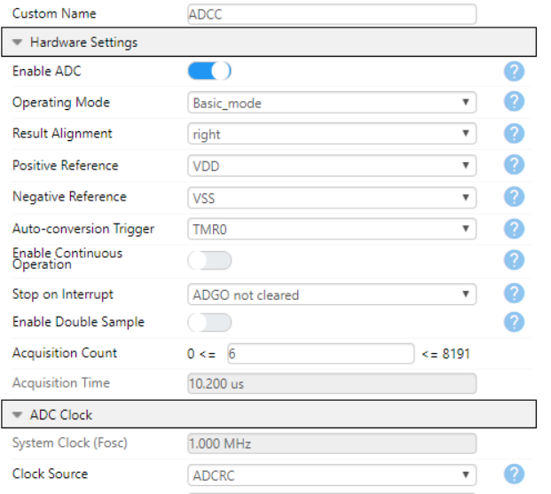  

(Not shown - interrupt enabled.)

### OPAMP Settings

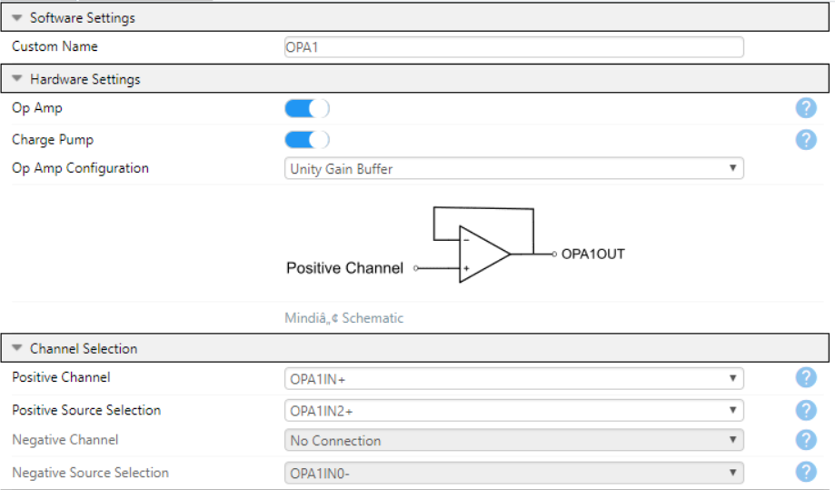

### TMR0 Diagram

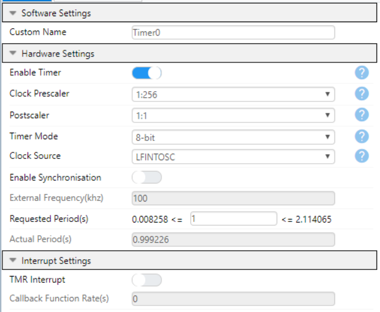

### TMR2 Diagram

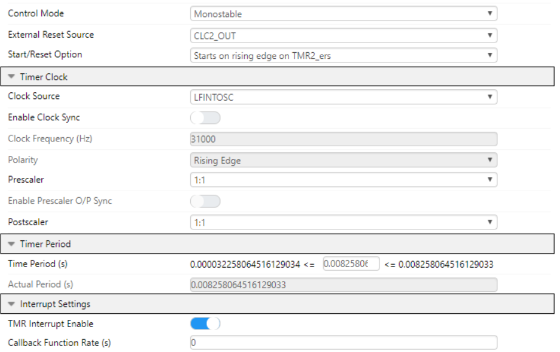

### CLC1 Diagram

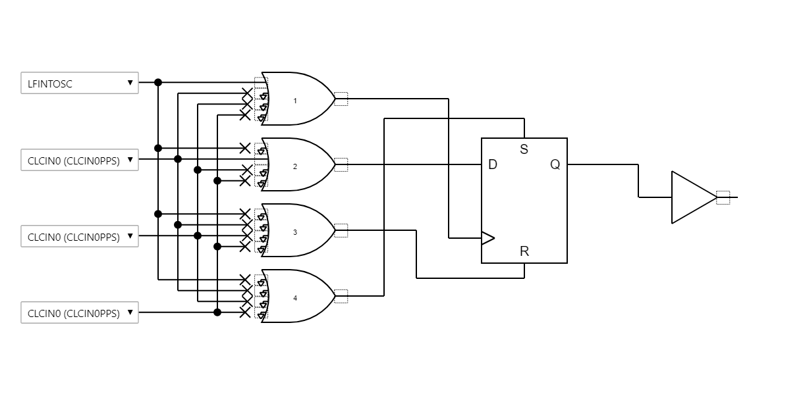

### CLC2 Diagram

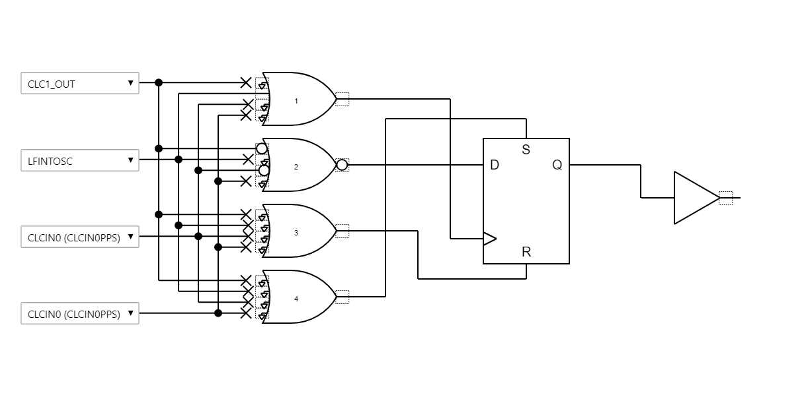

## Setting MPLAB Data Visualizer

The first step is to open the MPLAB Data Visualizer tool by pressing the "DV" icon in the toolbar as shown below.

*If this icon is not shown, please install MPLAB Data Visualizer in the Tools &rarr; Plugins window before continuing.*

Then select the COM port associated with the Curiosity Nano by clicking on COM port entry. Set any settings required in the box below (defaults are OK for this example).

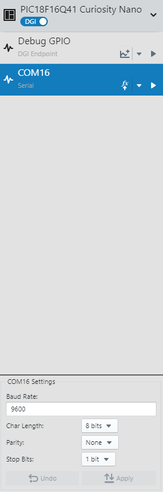

When the correct COM port has been selected and the Data Visualizer settings are set, press the play button to open the COM port.

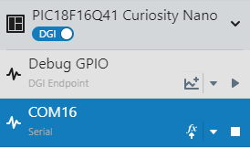

Once the COM port has been opened, the last step is to set the terminal window to use the COM port as a data source.

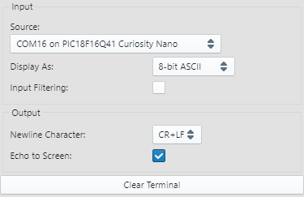

## Operation

This demo implements an analog signal chain with the OPAMP acting as a Programmable Gain Amplifier (PGA) for the ADC. The PGA can switch gains without using external components due to the internal resistor ladder on the device. There are 8 steps on the ladder plus a unity gain mode for a total of 9 possible gains (1x, 1.07x, 1.14x, 1.33x, 2x, 2.67x, 4x, 8x, 16x) with a single OPAMP.

The output signal from the OPAMP is measured by the ADCC about once per second. The ADCC is triggered to start a measurement using Timer 0. When the measurement is complete, an interrupt is triggered by the ADC to wake the MCU from Sleep.

LED0 on the Curiosity Nano toggles when the MCU is ready to print a result. The current configured gain of the OPAMP and the actual ADCC measured values are printed to the UART terminal at 9600 baud (see example image below). Once the UART is idle (and a gain switch is not pending), then the microcontroller enters Sleep to save power.

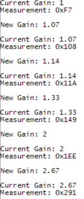

To switch the OPAMP gain configuration, press button SW0 on the Curiosity Nano. The output signal from SW0 is debounced using 2 CLCs and TMR2. The rising edge of the CLCs output triggers TMR2. When Timer 2 rolls over, an interrupt occurs, which wakes the MCU to perform the following steps:

1. Stop TMR0
2. Modify the gain (and configuration) of the OPAMP
3. Print the new OPAMP gain to the terminal
4. Clear and Restart TMR0
5. Return to Sleep

Each time the button is pressed, the gain is increased by one step. If the gain is at the maximum value, then the gain is switched to 1x and the pattern repeats.

## Summary
This demo has shown how to implement the OPAMP to function as a PGA for the ADCC for signal measurements.
