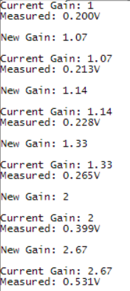

<!-- Please do not change this logo with link -->

# Signal Scaling with the OPAMP on the PIC18-Q41 Family of MCUs

This demo application shows how to use one of the Operational Amplifiers (OPAMP) in the PIC18-Q41 family of MCUs to create a Programmable Gain Amplifier for the on-board Analog-to-Digital Converter with Computation (ADCC). The ADCC is triggered automatically by Timer 0 (TMR0) while in sleep to reduce power consumption and improve measurement results. Pushbutton debouncing is performed by the Configurable Logic Cells (CLCs) and Timer 2 (TMR2).

## Related Documentation

- [PIC18F16Q41 Documentation](#)

## Software Used

- [MPLAB® X IDE v5.50 or newer](#)
- [MPLAB XC8 v2.32 or newer](#)
- [MPLAB Code Configurator (MCC) v4.2.3](#)
  - [Melody Library v1.84.5](#)
- [PIC18F-Q_DFP v1.12.193 or newer](https://packs.download.microchip.com/)
- [MPLAB Data Visualizer Plugin](#) or serial terminal

## Hardware Used

- [PIC18F16Q41 Curiosity Nano Evaluation Kit (???)](#)
- Variable Power Supply or Other Signal Source
- Breadboard and Wire (for connecting)

## I/O Setup

| I/O Pin | Name
| ------  | ----
| RA2 | OPAMP Input (+)
| RB5 | UART RX (unused)
| RB7 | UART TX
| RC0 | Switch 0 (SW0)
| RC1 | LED0
| RC2 | OPAMP Output

## Peripheral Configuration

**UART** - 9600 Baud, 8-bits, No Parity, 1 Stop Bit  
**ADCC** - Single Sample, Clock source is ADCRC, Auto-Conversion Trigger TMR0, Interrupt on Sample  
**TMR0** - Runs from LFINTOSC at a period of 1s  
**TMR2** - Start on Rising Edge, Start/Trigger from CLC2_OUT, Period is 8.25ms     
**CLC1** - D-Input Flip-Flop, Clocked by LFINTOSC, Latched Value = SW0   
**CLC2** - D-Input Flip-Flop, Clocked by LFINTOSC, Latched Value = (CLC1_OUT & SW0)  

### CLC1 Diagram

### CLC2 Diagram

## Setting MPLAB Data Visualizer

First, open Data Visualizer by pressing the "DV" icon in the toolbar.

*If this icon is not shown, please install MPLAB Data Visualizer in the Tools &rarr; Plugins window before continuing.*

Then select the COM port associated with the Curiosity Nano (ATtiny1627 shown here) by clicking on COM port entry. Set any settings required in the box below (defaults are OK for this example).

Press the play button to open the COM port.

Finally, set the terminal window to use the COM port as a data source.

## Operation

This demo implements an analog signal chain with the OPAMP acting as a Programmable Gain Amplifier (PGA) for the ADC. The PGA can switch gains without using external components due to the internal resistor ladder on the device. There are 8 steps on the ladder plus a unity gain mode for a total of 9 possible gains (1x, 1.07x, 1.14x, 1.33x, 2x, 2.67x, 4x, 8x, 16x) with a single OPAMP.

The output signal from the OPAMP is measured by the ADCC about once per second. The ADCC is triggered to start a measurement from Timer 2. When the measurement is complete, an interrupt is triggered by the ADC to wake the MCU from sleep.

LED0 on the Curiosity Nano toggles when the MCU is ready to print a result. The current gain of the OPAMP and the measurement are printed to the UART terminal at 9600 baud (see example image below). Once the UART is idle, then the microcontroller enters sleep to save power.

To switch the OPAMP gain, press button SW0 on the Curiosity Nano. The output signal from SW0 is debounced by 2 CLCs. The rising edge of the CLCs output triggers TMR2. When Timer 2 rolls over, an interrupt occurs, the MCU performs the following steps:

- Stop TMR0
- Modify the gain (and configuration) of the OPAMP
- Print the new OPAMP gain to the terminal
- Clear and Restart TMR0
- Return to Sleep

Each time the button is pressed, the gain is increased by one step. If the gain is at max, then the gain is switched to 1x and the pattern repeats.

## Summary
This demo has shown how to use the OPAMP and ADCC on the PIC18-Q41 family of MCUs to implement a PGA for signal measurements.
